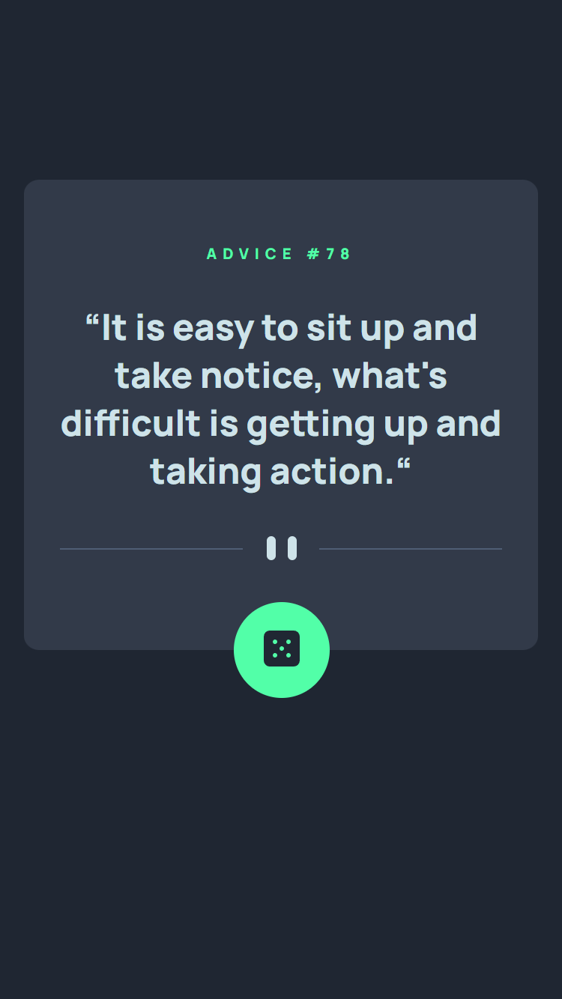
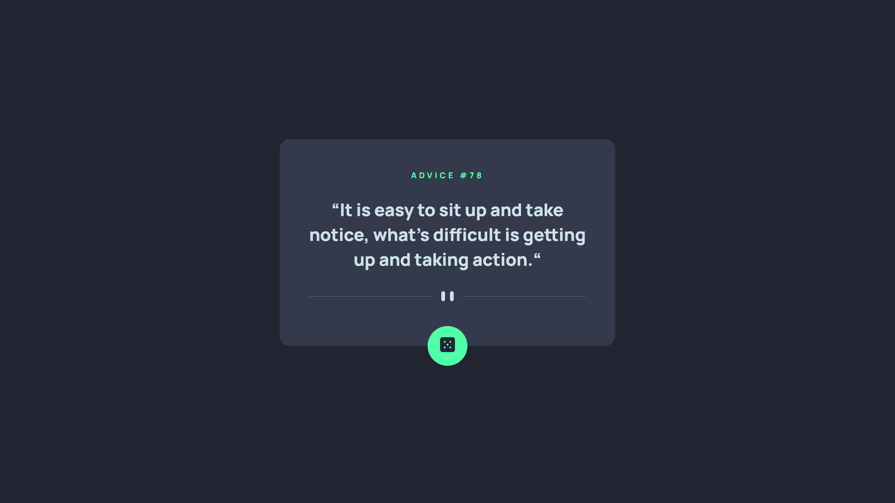

# Frontend Mentor - Advice generator app solution

This is a solution to the [Advice generator app challenge on Frontend Mentor](https://www.frontendmentor.io/challenges/advice-generator-app-QdUG-13db).

## Table of contents

- [Overview](#overview)
  - [The challenge](#the-challenge)
  - [Screenshot](#screenshot)
  - [Links](#links)
- [My process](#my-process)
  - [Built with](#built-with)
  - [What I learned](#what-i-learned)
  - [Continued development](#continued-development)
  - [Useful resources](#useful-resources)
- [Author](#author)

## Overview

### The challenge

Users should be able to:

- Click the button and get a new random piece of advice

### Screenshot

### Links

- Solution URL: [Add solution URL here](https://your-solution-url.com)
- Live Site URL: [Add live site URL here](https://your-live-site-url.com)

## My process

- My process consisted of writing out HTML and CSS first, getting a rough idea for a layout, starting with the mobile design. Then I used Javascript to add functionality to the site - getting data from an API with the fetch API, both on page load as well as when the user clicks on the button.
- Then I worked on the desktop design.
- Finally I focused on getting the design as close as possible to the provided files.

### Built with

- Semantic HTML5 markup
- CSS custom properties
- Flexbox
- Mobile-first workflow
- Plain Javascript

### What I learned

- How to use media queries in Javascript (via window.matchMedia)
- That using "textContent" is a [better idea]("https://kellegous.com/j/2013/02/27/innertext-vs-textcontent/") than using "innerText" 

### Continued development

The project only requires 2 media queries (375px and 1440px), continued development would include adding more device sizes to achieve better responsiveness.

### Useful resources

- [innerText vs textContent]("https://kellegous.com/j/2013/02/27/innertext-vs-textcontent/") - This helped me understand the differences between innerText and textContent.

## Author

- Website - Coming Soon!
- Frontend Mentor - [@TheDilp](https://www.frontendmentor.io/profile/TheDilp)
